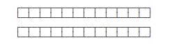
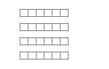

### Fork/Join
Java 7开始引入了一种新的Fork/Join线程池，它可以执行一种特殊的任务：把一个大任务拆成多个小任务并行执行。

----
举个例子：  
如果要计算一个超大数组的和，最简单的做法是用一个循环在一个线程内完成：  

----
还有一种方法：可以把数组拆成两部分，分别计算，最后加起来就是最终结果，这样可以用两个线程并行执行：  

----
如何拆成两部分还是很大，我们还可以继续拆分，用四个线程并行执行：  

----
以上就是Fork/Join任务的原理，判断一个任务是否足够小，如果是则直接计算，否则就拆分成几个小任务分别计算。这个过程可以反复"裂变"成一系列小任务。  

----
tips：  
Fork/Join线程池在Java标准库中就有应用：Java标准库提供的java.util.Arrays.parallelSort(array)可以进行并行排序，它的原理就是内部通过Fork/Join对大数组分拆进行并行排序，在多核CPU上就可以大大提高排序的速度。

---
Fork/Join是一种基于“分治”的算法：通过分解任务，并行执行，最后合并结果得到最终结果。

ForkJoinPool线程池可以把一个大任务分拆成小任务并行执行，任务类必须继承自RecursiveTask或RecursiveAction。

使用Fork/Join模式可以进行并行计算以提高效率。